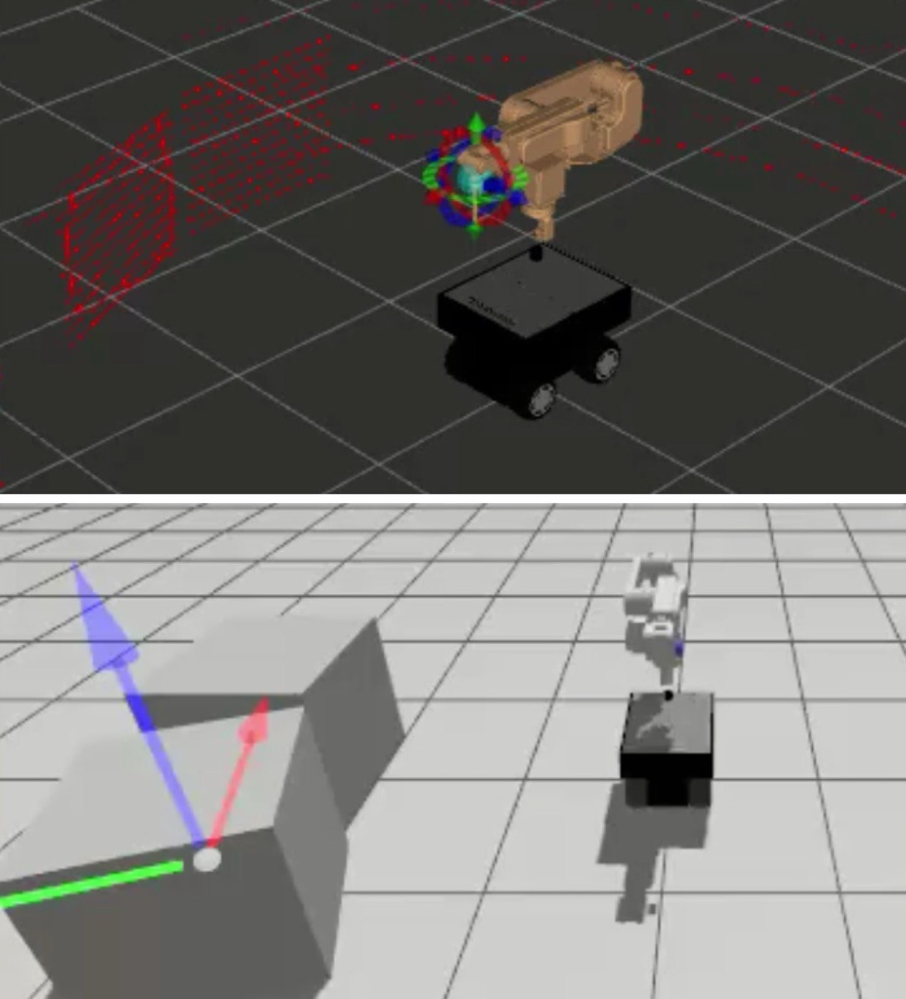

# Flat Surface Segmentation ROS2 Package

This ROS2 package processes 3D point clouds to detect and segment flat surfaces. It uses **PCL (Point Cloud Library)** for point cloud processing and publishes the detected planes, boundary markers, and waypoints for robotic applications.

  

## Features

- Subscribes to a point cloud topic (`/scan/points`) to receive input data.
- Detects flat surfaces using RANSAC-based plane segmentation.
- Extracts and simplifies the boundary of the segmented planes.
- Publishes:
  - Segmented planes as a PointCloud2 message (`/flat_surface_hull`).
  - Simplified boundary markers for visualization (`/segmentation_marker`).
  - Waypoints for robotic navigation or end-effector alignment (`/flat_surface_waypoints`).
- Includes services to:
  - Request processing of the point cloud (`/request_processing`).
  - Navigate between detected planes (`/next_plane`).

## Topics

| Topic                     | Type                            | Description                                    |
|---------------------------|----------------------------------|------------------------------------------------|
| `/scan/points`            | `sensor_msgs/msg/PointCloud2`   | Input point cloud data.                       |
| `/segmentation_marker`    | `visualization_msgs/msg/Marker` | Visual markers for the boundary of planes.    |
| `/flat_surface_hull`      | `sensor_msgs/msg/PointCloud2`   | Segmented plane as a concave hull.            |
| `/flat_surface_waypoints` | `geometry_msgs/msg/PoseArray`   | Waypoints along the boundary of flat surfaces.|

## Services

| Service                | Type                  | Description                                           |
|------------------------|-----------------------|-------------------------------------------------------|
| `/request_processing`  | `std_srvs/srv/Trigger` | Triggers point cloud processing.                     |
| `/next_plane`          | `std_srvs/srv/Trigger` | Switches to the next detected plane for visualization.|

## Dependencies

This package depends on the following libraries and ROS2 packages:

- ROS2 Humble or later.
- `pcl_ros` and `pcl_conversions` for PCL integration.
- `std_srvs`, `sensor_msgs`, `visualization_msgs`, and `geometry_msgs`.

Install required dependencies:
`sudo apt install ros-humble-pcl-ros ros-humble-pcl-conversions`

## Usage

1. Make sure to have launched both gazebo and Rviz (This one is only for simulation)

   `ros2 launch sherec_bot_bringup sherec_bot_gz.launch.py`
   
   `ros2 launch sherec_bot_bringup sherec_bot_move_group.launch.py`

3. Launch the node:
   
   `ros2 run lidar_path_planner_cpp lidar_subscriber`

4. Send a request to process a point cloud:

   `ros2 service call /request_processing std_srvs/srv/Trigger`

5. View segmentation results in RViz2:

    Add the `/segmentation_marker` topic as a Marker.
    Add the `/flat_surface_hull` topic as a PointCloud2.

6. Navigate through planes:

    `ros2 service call /next_plane std_srvs/srv/Trigger`

## Customization

You can adjust parameters like the RANSAC distance threshold, concave hull alpha value, and voxel grid leaf size directly in the source code or by adding a configuration file.
